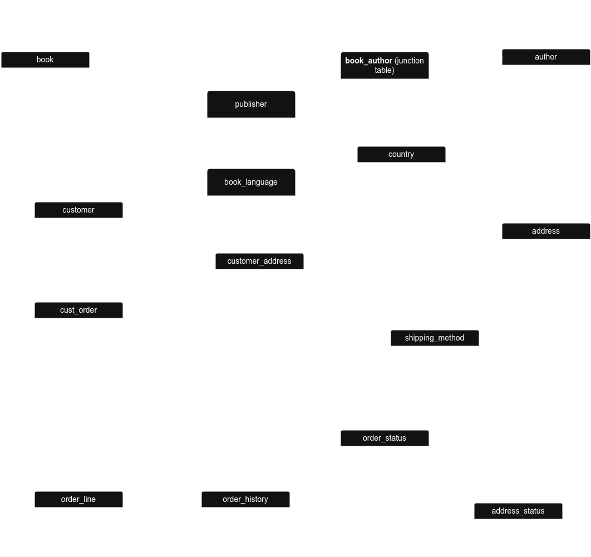

# Library Management System Database

## Project Overview
This comprehensive database system is designed to manage all aspects of a modern library's operations. The system handles books, patrons, loans, reservations, events, staff, and more, providing a complete solution for libraries of all sizes.

## Features
- **Book Management**: Track books, authors, publishers, categories, and individual book copies
- **Patron Management**: Maintain member records with membership status and history
- **Circulation Management**: Process loans, returns, renewals, and fines
- **Reservation System**: Allow patrons to reserve books that are currently unavailable
- **Event Management**: Schedule and track library events and attendance
- **Review System**: Enable patrons to rate and review books
- **Staff Management**: Track staff accounts with role-based permissions
- **Reporting**: Generate various reports through views and stored procedures

## Database Structure
The database follows a normalized relational design with the following core tables:
- `authors`: Information about book authors
- `publishers`: Book publisher details
- `categories`: Hierarchical book categories
- `books`: Core book information
- `book_copies`: Individual physical copies of books
- `patrons`: Library member information
- `staff`: Library staff accounts
- `loans`: Book checkout records
- `fines`: Records of fines for overdue or damaged items
- `reservations`: Book reservation system
- `events`: Library event information
- `reviews`: Patron book reviews and ratings

### Entity Relationship Diagram (ERD)


## Setup Instructions

### Prerequisites
- MySQL 8.0 or higher
- At least 50MB of database storage space

### Installation
1. Download the `library_management.sql` file
2. Connect to your MySQL server using a client or command line
3. Run the following command to import the database:
   ```
   mysql -u yourusername -p < library_management.sql
   ```
   Or in MySQL Workbench, use: Server > Data Import > Import from Self-Contained File

4. Verify the installation by running:
   ```sql
   USE library_management;
   SHOW TABLES;
   ```

## Usage Examples

### Add a new book with multiple copies
```sql
CALL add_new_book('The Great Gatsby', '9780743273565', '1925-04-10', 'English', 180, 1, 7, 'A novel about the mysteriously wealthy Jay Gatsby and his love for Daisy Buchanan.', 3, 3, @book_id);
```

### Check out a book to a patron
```sql
CALL checkout_book(5, 2, 1, 14);
```

### Return a book
```sql
CALL return_book(3, 2);
```

### Register a new patron
```sql
CALL register_patron('David', 'Miller', 'david.miller@email.com', '555-789-0123', '303 Cedar Ln, Newtown, NT 67890', '1988-12-05', 4);
```

### Generate monthly report
```sql
CALL generate_monthly_report(2023, 3);
```

## Views
The database includes several pre-configured views:
- `available_books`: Lists all books with available copies
- `overdue_loans`: Shows all currently overdue books
- `patron_activity`: Summarizes patron borrowing activity
- `popular_books`: Ranks books by checkout frequency and ratings
- `staff_activity`: Tracks staff activity across different functions
- `category_distribution`: Shows distribution of books across categories

## Security Considerations
- Staff passwords are stored as hashes (in a real implementation, use proper password hashing)
- The system includes role-based staff accounts
- Sensitive patron information is protected

## Maintenance
- Regular backups are recommended
- Consider setting up a scheduled task to:
  - Update membership statuses based on expiry dates
  - Generate automatic fine notices for overdue books
  - Archive old loan records

## License
This database structure is provided under the MIT License.

## Author
Created by Sylvester on April 15, 2025